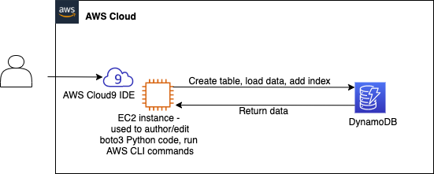

# Working with Amazon DynamoDB

I use Amazon DynamoDB to store and manage menu information. Using databases, such as DynamoDB, simplifies data management because you can easily query, sort, edit, and index data. You will use both the AWS Command Line Interface (AWS CLI) and the AWS SDK for Python (Boto3) to work with DynamoDB.

In upcoming labs, I will use application programming interface (API) calls from the café website to dynamically retrieve and update data that's stored in a DynamoDB table.

At the end of this lab, my architecture will look like the following example:

The full documentation you can find [here](dynamodb.ipynb).

